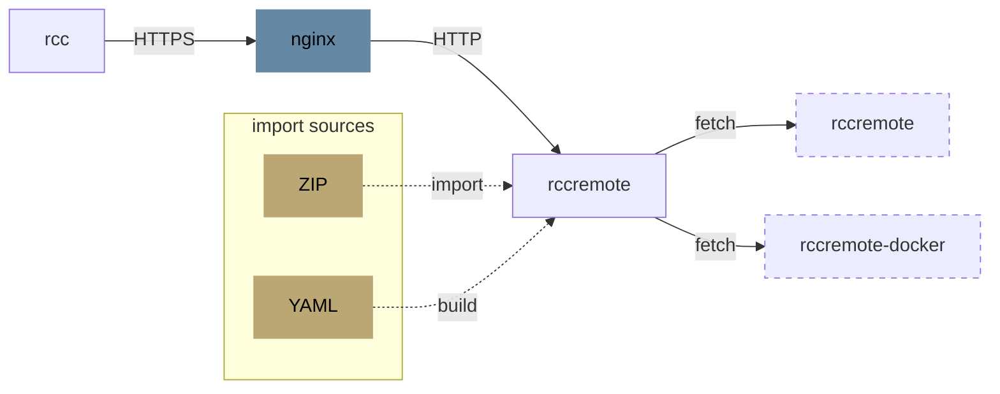
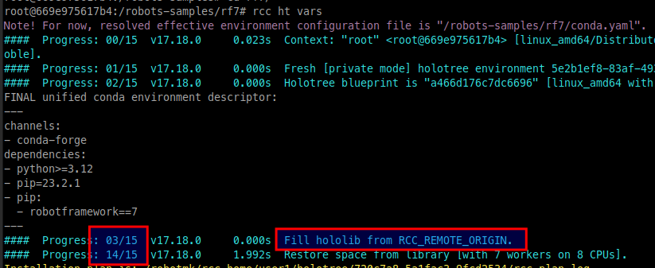

# rccremote-docker

Docker-compose setup with SSL for [rccremote](https://sema4.ai/docs/automation/rcc/overview).



## Background

### Purpose of this project

In order to built RCC environments with **rcc**, the host must be connected to the Internet in order to download the installation sources for Python/Node.js/etc.  
However, for security reasons, test clients are often completely isolated from the Internet.

**RCCRemote** solves this problem by serving the blueprints of these environments (aka "_Catalogs_") for **RCC** clients which can fetch the blueprints from there.  
This centralized approach does not only save network traffic and computing resources, but also is a significant performance gain, because when the clients ask for environments, rccremote only relays the missing files, not the whole environment.

By default, **rccremote** operates unencrypted, meaning **rcc** cannot verify the connection, nor is the data transmission encrypted.  

This setup provides a way to run RCCRemote behind a reverse proxy (nginx) which TLS encryption and server authentication. 

### Terminlogy

RCC-internal concepts:

- **Hololib**: A **Collection** of currently available **catalogs**.
  - **Catalog**: A blueprint of an environment which can be used to create an arbitrary number of instances of this environment.
- **Holotree**: A **Collection** of currently available **spaces**.
  - **Space**: An instance of an environment. There is a one-to-many relation between catalog and space.

## Quick Start 

### Option 1: Using own certificates 

Copy your certificate files into `/certs`:

- Server certificate: 
  - `server.crt` (X.509 compatible)
  - `server.key` 
- Root certificate: 
  - `rootCA.pem` (if the server certificate is signed by a CA - recommended) - Note: the server certificate must contain the SAN (X509v3 Subject Alternative Name) attribute.

### Option 2: Auto-created certificates

There are two way which both are only meant for testing/demonstration purposes: 

- auto-created self-signed
- auto-created signed (with rootCA)

#### auto-created self-signed

If you want the **nginx** container to create a self-signed certificate, leave the `certs` folder empty.  
Nginx will then create a self-signed certificate on the very first start. 

#### auto-created signed

If you want to use a signed certificate, you have to execute a generator script: 

```
cd scripts
./create-signed-cert.sh
SERVER_NAME is set to rccremote.local in .env file.
Openssl configuration created successfully with server name rccremote.local (/tmp/tmp.JIFD8POnxX).
Ready to generate the certificates now. This will empty the cert dir ../certs.
=> Are you sure? (y/n)
```

### Setting the server name

Set the **server name** used in the certificate to the env variable `SERVER_NAME`: 

- `export SERVER_NAME=rccremote.local`
- OR 
- edit the variable `SERVER_NAME` in `.env`

### Starting the containers

```
docker compose up -d
```

This will spin up 2 containers: 

- **rccremote** 
- **nginx**

By default, the **rccremote** container does not serve any Catalogs. See next section how to add environments.

## Usage

There are basically two modes to add Catalogs by placing files into these folders: 

- A) `./data/robots` - Containing Robot directories with `robot.yaml`/`conda.yaml`: **build and import** on startup
- B) `./data/hololib_zip` - Containing ZIP files of exported Catalogs: **import** on startup
- C) using another **rccremote** server (cascaded setup, not yet implemented)

Both modes can be used simultanously. In the following, they are explained. 

### Mode A: Add Robot directories

The **rccremote** container first uses **rcc** to build the Catalogs for each directory where it locates `robot.yaml`/`conda.yaml` files.  

As this happens inside of the Docker container, the created Catalogs are **for Linux systems only**.  

By default, all builds compile for the Holotree path `/opt/robocorp`. If the **rcc** clients operate on systems where this path is useable, this is fine. The environment would be created below of this path then. 

To change the holotree path, the Robot folders can contain a `.env` file: 

```
ROBOCORP_HOME=/robotmk/rcc_home/current_user
```

(For examples, see `./data/robots-examples/`).

Before each build, **rcc** sources this file so that the Catalog is built against a custom `ROBOCORP_HOME`.
After each environment creation, the environment gets exported into a ZIP file (volume: hololib_zip_internal).

Finally, all ZIP files are imported into the shared holotree, before the **rccremote** server process gets started. 

### Mode B: Add Hololib ZIP files

This mode is divided into 2 sub steps: 

- **Create the environments** on a build machine (Linux/Windows) which has internet access
- **Add the ZIP files** into `./data/hololib_zip`

#### Step 1: Create the environments

On the machine where you can build environments with internet access, set `ROBOCORP_HOME` to a path where the Catalogs should be built against. 

**Example**: 

You want to create a Hololib ZIP which can be used on a Windows test client (Windows). The system executing the Robot expects all Catalogs and Spaces for user `alice` in `C:\robotmk\rcc_home\alice`.

```
set ROBOCORP_HOME=C:\robotmk\rcc_home\alice
cd myrobot
# create the catalog (+space), using the custom ROBOCORP_HOME
rcc holotree vars
# export the ZIP file
rcc holotree export -r robot.yaml -z rf_playwright_17_18.zip
```

#### Step 2: Add the ZIP files

Copy all exported catalog files into the folder `./data/hololib_zip`.  
When the **rccremote** container gets started, it imports all ZIP files into the shared holotree. 

## rcc: usage with rccremote

In `docker-compose.yaml` you can find the container **rcc**, commented by default.  
You do not need this container in production, but it's useful for testing **rcc** in combination with **rccremote**.

To use that container, follow these steps:

### Start the rcc client container

Uncomment the **rcc** container definition and start it: 

`docker compose up -d rcc`

Open a shell inside the **rcc** container: 

`docker exec -it rcc bash`


### RCC client profile configuration

On startup, the **rcc** container auto-configures the profile SSL-setting depending on whether the folder `certs` contains a root certificate (`rootCA.pem`) or not: 

If `rootCA.pem` is 
  
- **not present** => Profile **no-sslverify** with setting `verify-ssl: false`
- **present** => Profile **cabundle** with `verify-ssl: true` and the PEM content included into the profile YAML configuration

You can verify the active **rcc** profile with `rcc config switch`:

```
root@0ca74438d77f:/# rcc config switch
Available profiles:
- ssl-noverify: disabled SSL verification

Currently active profile is: ssl-noverify    # <----
OK.
```

### Testing rcc fetching the hololib from rccremote

Change into a robot folder below of `/robots` (this is the same host mounted `/robots` folder as on **rccremote**) where `robot.yaml` and `conda.yaml` files are. 

Verify that `RCC_REMOTE_ORIGIN` is set to the nginx server, port 443: 

```
root@0ca74438d77f:/robots/rf7# echo $RCC_REMOTE_ORIGIN
https://rccremote.local:443
```

Execute `rcc holotree vars`. **rcc** should be able to download the hololib from the server: 



## Debugging 

### Connection test from rcc to nginx

Test without the root certificate: 

    openssl s_client -connect rccremote.local:443
    ...
    ...
    Verify return code: 21 (unable to verify the first certificate)
    Extended master secret: no
    Max Early Data: 0
    ---
    read R BLOCK

Test with Root certificate: 

    openssl s_client -connect rccremote.local:443 -CAfile /etc/certs/rootCA.crt
    Verify return code: 0 (ok)     #  <------------------------------
    Extended master secret: no
    Max Early Data: 0
    ---
    read R BLOCK

### rcc settings

    rcc config diag

### rest

Show crt details: 

    openssl x509 -in /etc/nginx/server.crt -text -noout

Switch to default profile: 

    rcc config switch --noprofile

